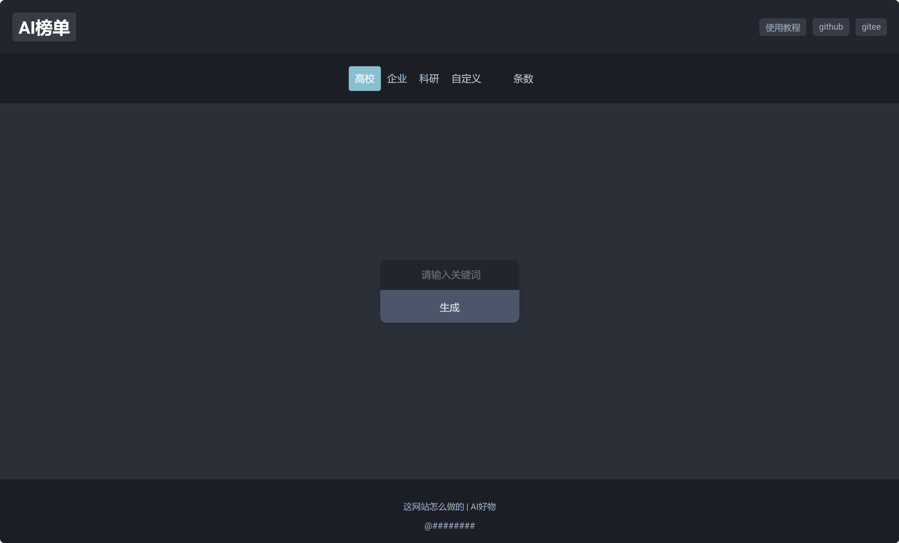
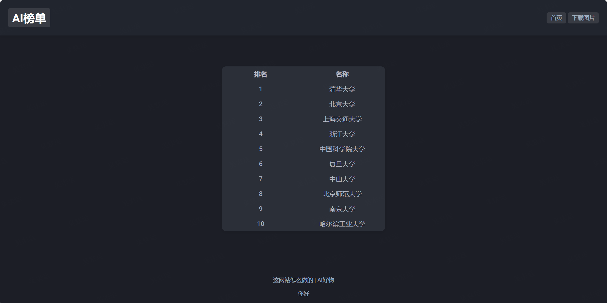
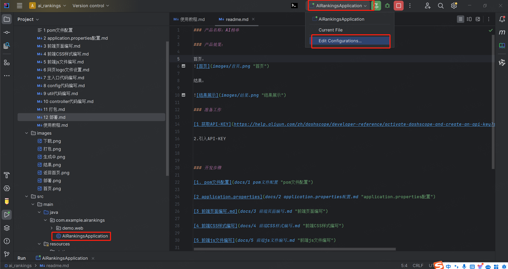
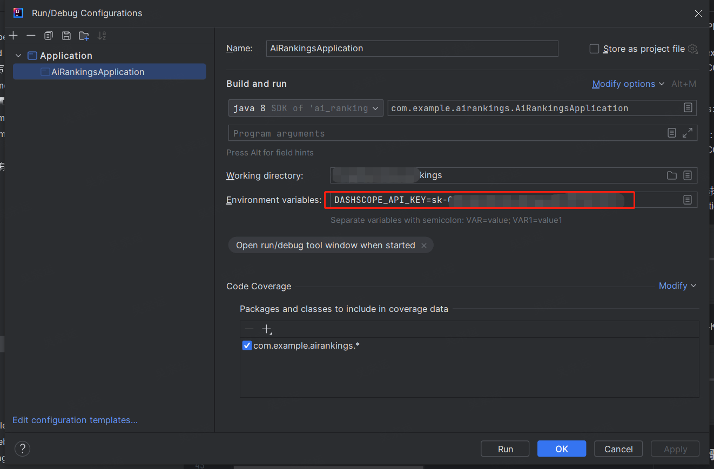

### 产品名称：AI榜单

### 产品地址：

[192.168.154.131](http://192.168.154.131/ranking "AI榜单")

### 产品效果：

首页：

结果：

### 准备工作

[1 获取大模型API-KEY](https://help.aliyun.com/zh/dashscope/developer-reference/activate-dashscope-and-create-an-api-key?spm=a2c4g.11186623.0.0.6d1b12b0REV142 "结果展示")

2.引入API-KEY

Linux：export DASHSCOPE_API_KEY=YOUR_API_KEY

Windows：

Terminal：export DASHSCOPE_API_KEY=YOUR_API_KEY

Idea：选择入口主程序 -> Edit Configrations

配置API-KEY

### 开发步骤

[1. pom文件配置](https://github.com/Mrkuhuo/ai-ranking/blob/main/docs/1%20pom%E6%96%87%E4%BB%B6%E9%85%8D%E7%BD%AE.md)

[2 application.properties](https://github.com/Mrkuhuo/ai-ranking/blob/main/docs/2%20application.properties%E9%85%8D%E7%BD%AE.md)

[3 前端页面编写.md](https://github.com/Mrkuhuo/ai-ranking/blob/main/docs/3%20%E5%89%8D%E7%AB%AF%E9%A1%B5%E9%9D%A2%E7%BC%96%E5%86%99.md)

[4 前端CSS样式编写](https://github.com/Mrkuhuo/ai-ranking/blob/main/docs/4%20%E5%89%8D%E7%AB%AFCSS%E6%A0%B7%E5%BC%8F%E7%BC%96%E5%86%99.md)

[5 前端js文件编写](https://github.com/Mrkuhuo/ai-ranking/blob/main/docs/5%20%E5%89%8D%E7%AB%AFjs%E6%96%87%E4%BB%B6%E7%BC%96%E5%86%99.md)

[6 网页logo文件设置](https://github.com/Mrkuhuo/ai-ranking/blob/main/docs/6%20%E7%BD%91%E9%A1%B5logo%E6%96%87%E4%BB%B6%E8%AE%BE%E7%BD%AE.md)

[7 主入口代码编写](https://github.com/Mrkuhuo/ai-ranking/blob/main/docs/7%20%E4%B8%BB%E5%85%A5%E5%8F%A3%E4%BB%A3%E7%A0%81%E7%BC%96%E5%86%99.md)

[8 config代码编写](https://github.com/Mrkuhuo/ai-ranking/blob/main/docs/8%20config%E4%BB%A3%E7%A0%81%E7%BC%96%E5%86%99.md)

[9 util代码编写](https://github.com/Mrkuhuo/ai-ranking/blob/main/docs/9%20util%E4%BB%A3%E7%A0%81%E7%BC%96%E5%86%99.md)

[10 controller代码编写](https://github.com/Mrkuhuo/ai-ranking/blob/main/docs/10%20controller%E4%BB%A3%E7%A0%81%E7%BC%96%E5%86%99.md)

[11 打包](https://github.com/Mrkuhuo/ai-ranking/blob/main/docs/11%20%E6%89%93%E5%8C%85.md)

[12 部署](https://github.com/Mrkuhuo/ai-ranking/blob/main/docs/12%20%E9%83%A8%E7%BD%B2.md)